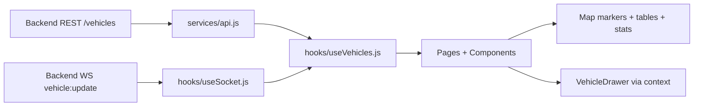

# Architecture

## High-level flow

1. `App` bootstraps routing and global providers.
2. Pages request vehicle data from `useVehicles`.
3. `useVehicles` fetches `/vehicles` via Axios service.
4. `useSocket` listens to `vehicle:update` events.
5. Live updates patch vehicle state in memory.
6. Map and tables re-render with latest values.
7. Marker/row click opens global `VehicleDrawer` via context.

## UI layers

- `AppShell`: shared layout (Sidebar + TopBar + content).
- `pages/*`: route-level screens.
- `components/*`: reusable UI and domain widgets.
- `hooks/*`: data/realtime logic.
- `services/*`: API client functions.

## Data flow diagram

