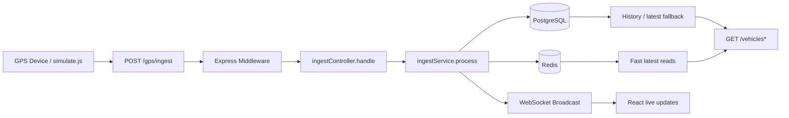

# Architecture

## High-level flow

The ingest pipeline is:

1. GPS device/simulator sends payload to `POST /gps/ingest`.
2. Express request pipeline runs logger + validation middleware.
3. `ingestController` forwards payload to `ingestService`.
4. `ingestService` writes complete data in PostgreSQL inside one transaction.
5. After commit, latest simplified state is cached in Redis.
6. WebSocket broadcast pushes real-time updates to connected clients.
7. React frontend reads data via REST + listens over WS for live updates.

## Layer responsibilities

- **Routes**: HTTP endpoint wiring only.
- **Controllers**: request/response orchestration, no business logic.
- **Services**: DB/Redis/WS logic and transaction workflow.
- **DB layer**: connection, migration execution, helper functions.
- **Middleware**: request logging, payload validation, global error mapping.
- **WS server**: client connection lifecycle + event broadcasting.

## Full flow diagram

## ingestService transaction steps

1. Get PostgreSQL client from pool.
2. `BEGIN` transaction.
3. `upsertVehicle(...)` in `vehicles`.
4. `insertPosition(...)` in `gps_positions`.
5. `insertVehicleState(...)` in `vehicle_state`.
6. `insertCanFlags(...)` in `can_flags`.
7. `COMMIT` on success.
8. `ROLLBACK` on error and rethrow.
9. Release DB client in `finally`.
10. Cache latest state in Redis and broadcast `vehicle:update` over WS.
